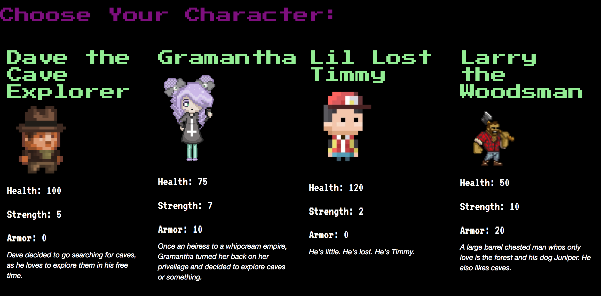
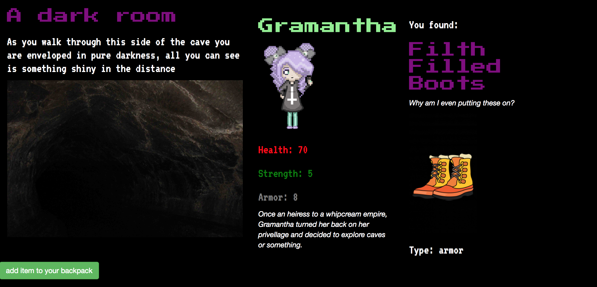
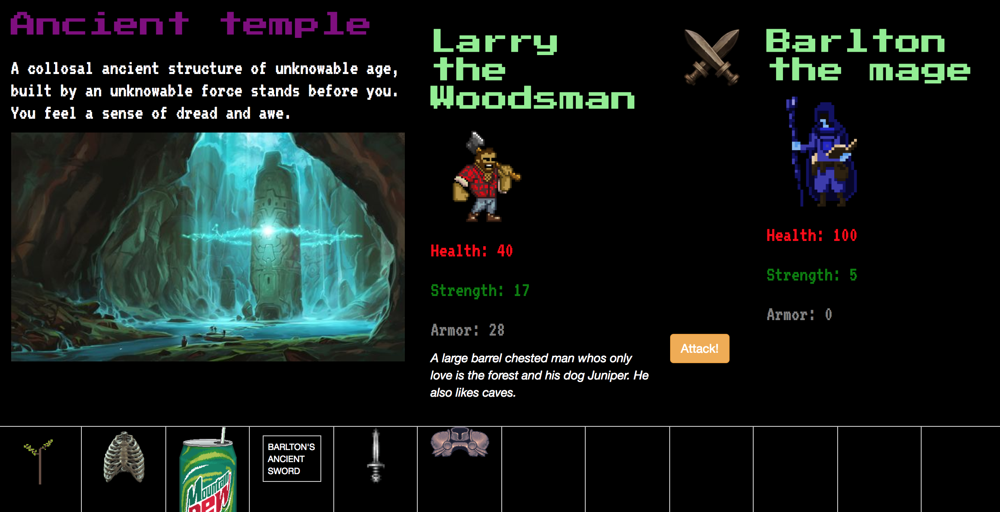
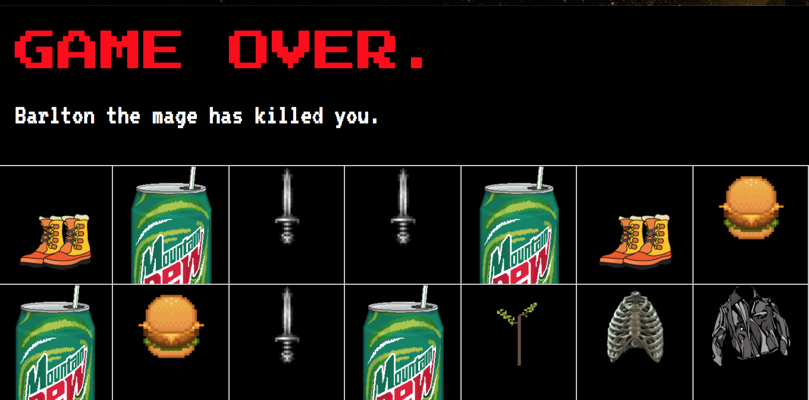

# Cave Explorers: The Game

This project was generated with [Angular CLI](https://github.com/angular/angular-cli) version 1.0.0.

# Instructions for setup

first start by cloning the project and `cd angular-extended` into the project directory.

Once inside run  `npm install && bower install`

This project requires access to a Firebase realtime database, you will need to have an `api-keys.ts` file in the app folder.

if you are unfamiliar with Firebase refer to this `https://www.learnhowtoprogram.com/javascript/angular-extended/firebase-introduction-and-setup` for setup instructions.

once you have completed these step you may run `ng serve` for a dev server. Navigate to `http://localhost:4200/`. The app will automatically reload if you change any of the source files.

## Choose your character screen

When you start the game you will see 4 characters to choose from, click the one you would like to play as.

## Pick up items along the way

You will be able to search each room in the cave for items. Each area has regular items that drop, but there is a lower chance to get a better and more rare item. Items that you pick up will add a modifier based on item type to your character's stats. Items that are considered junk will not add to your inventory when you pick them up. Armor is better than health per point, and strength is how much damage you will do in an attack.

##Fighting enemies

When you do battle you will hit the enemy until they run out of health, or they will hit you until you run out of health.

##Dying

If your health gets to 0 then the game is over.

## Code scaffolding

Run `ng generate component component-name` to generate a new component. You can also use `ng generate directive/pipe/service/class/module`.

## Build

Run `ng build` to build the project. The build artifacts will be stored in the `dist/` directory. Use the `-prod` flag for a production build.

## Running unit tests

Run `ng test` to execute the unit tests via [Karma](https://karma-runner.github.io).

## Running end-to-end tests

Run `ng e2e` to execute the end-to-end tests via [Protractor](http://www.protractortest.org/).
Before running the tests make sure you are serving the app via `ng serve`.

## Further help

To get more help on the Angular CLI use `ng help` or go check out the [Angular CLI README](https://github.com/angular/angular-cli/blob/master/README.md).
